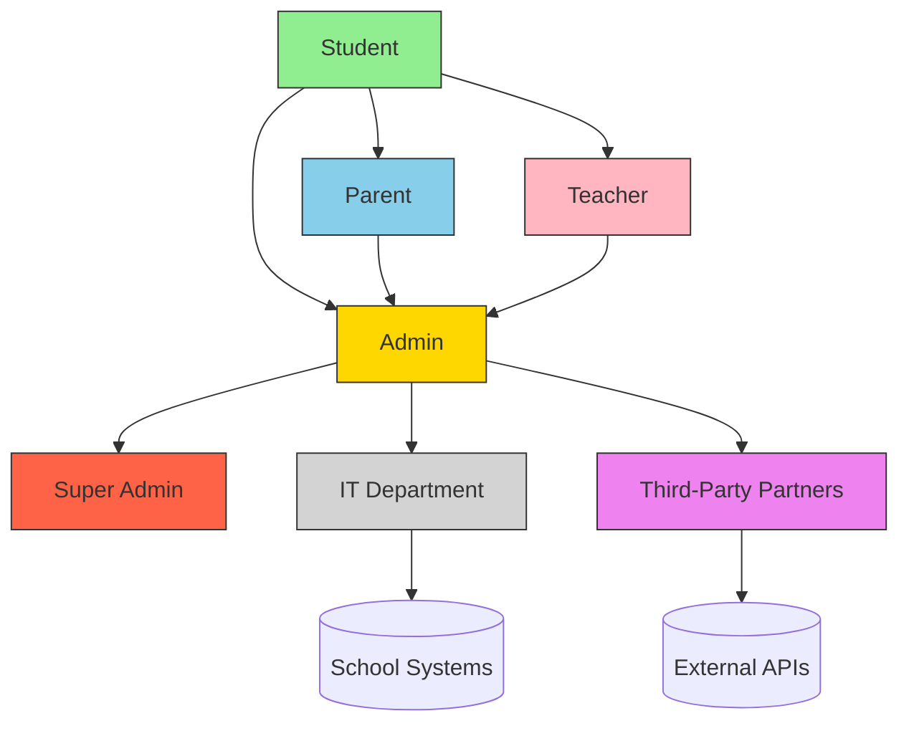

# Exam Preparation Platform Product Requirements Document

## 1. Executive Summary
A web-based platform designed to help IGCSE students prepare for exams through realistic test simulations while providing parents and school administrators with comprehensive progress tracking tools. The system will support three distinct user roles with tailored experiences and layered access controls.

## 2. Objectives
- Provide realistic exam simulation environment for students
- Enable parental oversight of academic progress
- Empower school administrators with institutional analytics
- Ensure secure handling of sensitive educational data
- Support scalable user management for educational institutions

## 3. Stakeholders

**Relationship Explanation:**
- **Students** are central to all interactions
- **Parents** connect through student linkages
- **Teachers** interact with students and administrators
- **Admins** manage all user relationships
- **Super Admins** oversee security and system-wide operations
- **IT Department** maintains infrastructure integrations
- **Third-Party Partners** provide external system integrations

## 4. User Roles & Permissions
| Role | Access Level | Key Permissions |
|------|--------------|-----------------|
| Student | Basic | Test taking, Personal analytics, Profile management |
| Parent | Intermediate | Student progress monitoring, Notification management |
| Admin | Elevated | User management, System configuration, Institutional analytics |
| Super Admin | Highest | Security controls, Audit logs, Backup management |

## 5. Core Features

### 5.1 User Management Module
- **Student Portal**
  - Secure credential management (JWT authentication)
  - Password recovery with email verification
  - Profile customization with academic preferences

- **Parent Portal**
  - Student account linking via school ID verification
  - Multi-factor authentication options
  - Notification preference center

- **Admin Console**
  - Bulk CSV import/export of user accounts
  - Role-based access control (RBAC) system
  - Audit trail with activity monitoring

### 5.2 Exam Simulation Module
- Timed practice exams with real test conditions
- Subject-specific question banks
- Instant scoring with performance breakdowns
- Historical attempt comparison charts

### 5.3 Analytics & Reporting
- Real-time student progress dashboards
- Institutional benchmarking tools
- Custom report builder with filters:
  - By subject
  - By date range
  - By performance quartiles
- Automated report scheduling (daily/weekly/monthly)

### 5.4 Notification System
- Event-driven alerts for:
  - Completed tests
  - Account changes
  - System updates
- Multi-channel delivery (Email/SMS/In-app)
- Configurable escalation paths

## 6. Technical Requirements

### 6.1 Architecture
- Frontend: React PWA with offline capabilities
- Backend: Node.js microservices architecture
- Database: MongoDB with Redis caching
- Analytics: Elasticsearch + Kibana dashboard

### 6.2 Security
- Role-based data access controls
- Encryption at rest (AES-256) and in transit (TLS 1.3)
- Regular penetration testing requirements
- GDPR-compliant data handling procedures

### 6.3 Performance
- <500ms API response times under load
- Support 10,000 concurrent exam sessions
- 99.9% uptime SLA for core features

### 6.4 AI Development Strategy
- Leverage AI-assisted coding tools for:
  - Automated code generation (40% of boilerplate)
  - Intelligent test case creation
  - Security vulnerability scanning
  - Performance optimization suggestions
- Maintain human oversight for:
  - Architectural decisions
  - Compliance implementations
  - User experience flows
  - Sensitive data handling

## 7. Compliance Requirements
- COPPA compliance for under-13 users
- FERPA-compliant data storage (US)
- GDPR-compliant data processing (EU)
- WCAG 2.1 AA accessibility standards

## 8. Milestones (AI-Accelerated)

| Phase | Timeline | Deliverables | AI Impact Areas |
|-------|----------|--------------|-----------------|
| 1 | Q2 2025 | Core student exam experience | - AI-generated UI components - Automated test suites - Schema optimization |
| 2 | Q3 2025 | Parent portal & basic analytics | - Smart API generation - Predictive analytics models - Access control templates |
| 3 | Q4 2025 | Admin console & institutional tools | - Automated RBAC configs - AI-optimized queries - Compliance rule generation |
| 4 | Q1 2026 | Advanced reporting & SIS integrations | - NLP-based report drafting - Intelligent API connectors - Auto-generated docs |

## 9. Success Metrics
- 80% student retention rate after first test
- 95% parent account activation rate
- <2% failed login attempt rate
- 90% institutional renewal rate

## 10. Risks & Mitigations
- **Data Security Risks**: Regular audits + bug bounty program
- **User Adoption Risks**: Onboarding tutorials + institutional training
- **Performance Risks**: Load testing + auto-scaling infrastructure
- **Compliance Risks**: Legal review team + regional configuration
- **AI Development Risks**: 
  - Mitigation: Hybrid review process + architecture guardrails
  - Mitigation: Version-controlled AI artifacts
  - Mitigation: Regular human audit checkpoints

## 11. Future Roadmap
- AI-powered adaptive learning paths
- Mobile app development (iOS/Android)
- Virtual proctoring capabilities
- Social learning features
- Marketplace for third-party content 