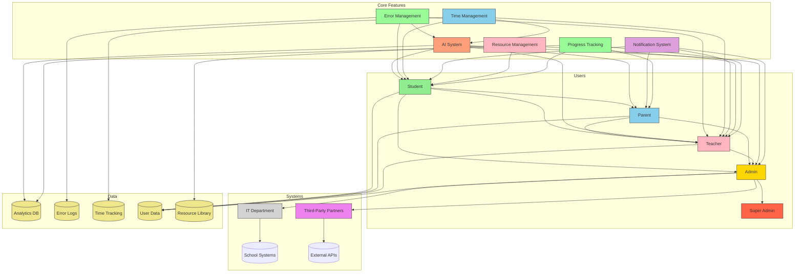

# Exam Preparation Platform Product Requirements Document

## 1. Executive Summary
A web-based platform designed to help IGCSE students prepare for exams through realistic test simulations while providing parents and school administrators with comprehensive progress tracking tools. The system will support three distinct user roles with tailored experiences and layered access controls, prioritizing simplicity, ease of use, and efficiency.

## 2. Objectives
- Provide realistic exam simulation environment for students
- Enable parental oversight of academic progress
- Empower school administrators with institutional analytics
- Ensure secure handling of sensitive educational data
- Support scalable user management for educational institutions
- Implement AI-driven personalized learning paths
- Focus on error management and improvement tracking
- Support efficient time management and study habits

## 3. Stakeholders

**Relationship Explanation:**
- **Users**
  - **Students** are central to all interactions
  - **Parents** connect through student linkages and direct teacher communication
  - **Teachers** interact with students, parents, and administrators
  - **Admins** manage all user relationships
  - **Super Admins** oversee security and system-wide operations

- **Systems**
  - **IT Department** maintains infrastructure integrations
  - **Third-Party Partners** provide external system integrations
  - **School Systems** integrate with the platform
  - **External APIs** provide additional functionality

- **Core Features**
  - **AI System** provides personalized learning paths and insights
  - **Error Management** tracks and analyzes student mistakes
  - **Time Management** optimizes study sessions and progress
  - **Notification System** handles all user communications
  - **Resource Management** enables teachers to share and manage educational content
  - **Progress Tracking** monitors student performance across all stakeholders

- **Data**
  - **Analytics DB** stores performance metrics
  - **Error Logs** track learning patterns
  - **Time Tracking** monitors study habits
  - **User Data** manages account information
  - **Resource Library** stores educational materials and practice sets

## 4. User Roles & Permissions
| Role | Access Level | Key Permissions |
|------|--------------|-----------------|
| Student | Basic | Test taking, Personal analytics, Profile management, Error tracking, Progress monitoring |
| Parent | Intermediate | Student progress monitoring, Notification management, Performance analytics, Teacher communication |
| Teacher | Intermediate | Student progress monitoring, Class management, Parent communication, Custom practice sets, Performance analytics |
| Admin | Elevated | User management, System configuration, Institutional analytics, Error pattern analysis |
| Super Admin | Highest | Security controls, Audit logs, Backup management, System-wide analytics |

## 4.1 Teacher User Journey

### Initial Setup
1. **Account Creation**
   - Admin creates teacher account
   - Teacher receives welcome email with login credentials
   - Teacher completes profile setup with:
     - Personal information
     - Subject expertise
     - Class details
     - Teaching preferences
   **Success Criteria:**
   - Account created within 24 hours of admin request
   - Welcome email delivered within 5 minutes
   - Profile completion rate > 90% within 48 hours
   - All required fields filled with valid information

2. **Class Setup**
   - Create new class or import existing class list
   - Set class schedule and subject details
   - Configure class-specific settings
   - Set up parent communication preferences
   **Success Criteria:**
   - Class creation completed within 15 minutes
   - Bulk import success rate > 95%
   - All required class settings configured
   - Parent communication preferences set for > 80% of students

### Daily Operations
1. **Morning Routine**
   - Review class dashboard
   - Check student attendance
   - Review overnight student progress
   - Prepare daily announcements
   **Success Criteria:**
   - Dashboard load time < 3 seconds
   - Attendance marked for > 95% of students
   - Progress review completed within 10 minutes
   - Announcements posted before class start

2. **Class Management**
   - Access class-specific resources
   - Monitor real-time student progress
   - Send class-wide announcements
   - Manage practice sessions
   - Track student participation
   **Success Criteria:**
   - Resource access time < 2 seconds
   - Real-time updates with < 1 second latency
   - Announcement delivery rate > 98%
   - Practice session completion rate > 85%
   - Participation tracking accuracy > 95%

3. **Resource Management**
   - Create/assign practice sets
   - Share educational materials
   - Manage resource library
   - Set up custom assessments
   - Organize study materials
   **Success Criteria:**
   - Practice set creation < 10 minutes
   - Resource sharing success rate > 95%
   - Library organization completed weekly
   - Assessment setup < 15 minutes
   - Material organization updated daily

4. **Progress Monitoring**
   - Track individual student performance
   - Review class-wide analytics
   - Identify struggling students
   - Monitor improvement trends
   - Generate progress reports
   **Success Criteria:**
   - Individual tracking updated daily
   - Analytics dashboard load < 2 seconds
   - Struggling students identified within 24 hours
   - Trend analysis updated weekly
   - Report generation < 5 minutes

5. **Parent Communication**
   - Send progress updates
   - Schedule parent-teacher meetings
   - Respond to parent queries
   - Share student achievements
   - Provide feedback and recommendations
   **Success Criteria:**
   - Update delivery rate > 95%
   - Meeting scheduling completed within 24 hours
   - Query response time < 4 hours
   - Achievement sharing within 48 hours
   - Feedback provided weekly

### Weekly Activities
1. **Performance Analysis**
   - Review weekly progress reports
   - Analyze error patterns
   - Adjust teaching strategies
   - Update student groupings
   - Plan intervention strategies
   **Success Criteria:**
   - Report review completed within 2 hours
   - Error pattern analysis accuracy > 90%
   - Strategy adjustments documented
   - Groupings updated weekly
   - Intervention plans created for all struggling students

2. **Resource Planning**
   - Prepare weekly materials
   - Update resource library
   - Create new practice sets
   - Review and update assessments
   - Plan upcoming lessons
   **Success Criteria:**
   - Materials prepared by weekend
   - Library updated weekly
   - New practice sets created as needed
   - Assessments reviewed monthly
   - Lesson plans completed weekly

3. **Parent Engagement**
   - Send weekly progress summaries
   - Schedule upcoming meetings
   - Prepare parent communication
   - Review parent feedback
   - Update parent portal
   **Success Criteria:**
   - Summaries sent by Friday
   - Meetings scheduled within 48 hours
   - Communication prepared weekly
   - Feedback reviewed within 24 hours
   - Portal updated daily

### Monthly Tasks
1. **Comprehensive Review**
   - Generate monthly reports
   - Analyze long-term trends
   - Review class performance
   - Assess teaching effectiveness
   - Plan curriculum adjustments
   **Success Criteria:**
   - Reports generated within 24 hours
   - Trend analysis completed monthly
   - Performance review documented
   - Effectiveness metrics tracked
   - Adjustments planned quarterly

2. **Resource Optimization**
   - Review resource effectiveness
   - Update teaching materials
   - Optimize practice sets
   - Clean up resource library
   - Plan new content creation
   **Success Criteria:**
   - Effectiveness review completed monthly
   - Materials updated as needed
   - Practice sets optimized quarterly
   - Library cleaned monthly
   - Content plan created quarterly

3. **Parent-Teacher Engagement**
   - Conduct parent-teacher meetings
   - Share comprehensive reports
   - Discuss improvement strategies
   - Set new goals
   - Plan support initiatives
   **Success Criteria:**
   - Meetings conducted as scheduled
   - Reports shared 24 hours before meetings
   - Strategies documented
   - Goals set and tracked
   - Support plans created monthly

### End of Term Activities
1. **Performance Assessment**
   - Generate term reports
   - Analyze overall progress
   - Identify success areas
   - Document improvement needs
   - Plan next term strategies
   **Success Criteria:**
   - Reports generated within 48 hours
   - Progress analysis completed
   - Success areas documented
   - Improvement needs tracked
   - Strategies planned before term end

2. **Resource Management**
   - Archive term materials
   - Prepare for next term
   - Update teaching resources
   - Review content effectiveness
   - Plan new content
   **Success Criteria:**
   - Materials archived within 1 week
   - Next term preparation completed
   - Resources updated as needed
   - Content review documented
   - New content plan created

3. **Parent Communication**
   - Share term reports
   - Conduct final meetings
   - Provide summer recommendations
   - Set next term expectations
   - Document parent feedback
   **Success Criteria:**
   - Reports shared within 48 hours
   - Meetings completed as scheduled
   - Recommendations provided
   - Expectations documented
   - Feedback reviewed and addressed

## 5. Core Features

### 5.1 User Management Module
- **Student Portal**
  - Streamlined registration with only essential information:
    - Name
    - Email
    - IGCSE/A-Level selection
  - Simple username/password authentication
    - JWT-based security
    - Minimal verification steps
    - Clear error messaging
  - Password recovery with email verification
  - Profile customization with academic preferences
  - Clear, intuitive interface with minimal friction

- **Parent Portal**
  - Streamlined student account linking
  - Multi-factor authentication options
  - Notification preference center
  - Simplified progress tracking interface
  - Teacher communication channel
  - Parent-teacher meeting scheduling

- **Teacher Portal**
  - Class management dashboard
  - Student progress tracking
  - Parent communication tools
  - Custom practice set creation
  - Performance analytics
  - Resource sharing capabilities
  - Bulk student import/export
  - Class-specific announcements
  - Parent-teacher meeting scheduling
  - Individual student performance reports
  - Class-wide performance trends
  - Resource library management

- **Admin Console**
  - Bulk CSV import/export of user accounts
  - Role-based access control (RBAC) system
  - Audit trail with activity monitoring
  - Simplified user management interface

### 5.2 User Interface Design Principles
- **Minimalistic Layout**
  - Clean, uncluttered design
  - Limited font selection (maximum 2-3 fonts)
  - Neutral color scheme
  - Strategic use of whitespace
  - Consistent spacing and alignment

- **Navigation**
  - Fixed navigation elements across all pages
  - Clear hierarchy of information
  - Intuitive menu structure
  - Quick access to frequently used features
  - Consistent positioning of key elements

- **Homepage Design**
  - Concise platform overview
  - Clear value proposition
  - Direct calls to action
  - Featured courses and subjects
  - Progress highlights
  - Quick access to practice sessions

### 5.3 Exam Simulation Module
- **Course Display**
  - Clear subject categorization
  - Visual course cards with progress indicators
  - Easy-to-scan course listings
  - Quick access to practice sessions
  - Progress tracking per subject

- **Practice Questions**
  - Output-driven learning model:
    - Pre-lesson preparation materials
    - In-class practice features
    - Timed problem-solving challenges
    - Interactive exercises
    - Post-class timebound exercises
    - Comprehensive feedback system

- **Teacher Tools**
  - Custom practice set creation
  - Class-wide performance analytics
  - Individual student progress tracking
  - Resource sharing library
  - Parent communication templates
  - Class-specific announcements
  - Bulk student management
  - Performance comparison tools
  - Custom assessment creation
  - Student grouping tools
  - Progress report generation
  - Resource recommendation system

- **Layered Teaching Approach**
  - Dynamic student grouping based on performance
  - Tiered question sets:
    - Top tier university preparation
    - Standard university preparation
    - Foundation level
  - Personalized goal setting per tier
  - Adaptive difficulty progression

- **Time Management**
  - Micro-tasking system
  - Structured study sessions:
    - Concept review (15-20 minutes)
    - Problem solving (20-30 minutes)
    - Error analysis (10-15 minutes)
  - Progress tracking
  - Session recommendations

- **AI-Driven Features**
  - Real-time insights and reminders
  - Motivational feedback
  - Performance-based recommendations
  - Time management suggestions
  - Error pattern analysis
  - Personalized study paths

### 5.4 Analytics & Reporting
- Real-time student progress dashboards
- Institutional benchmarking tools
- Custom report builder with filters:
  - By subject
  - By date range
  - By performance quartiles
- Automated report scheduling (daily/weekly/monthly)
- Error pattern analysis
- Time management analytics

### 5.5 Notification System
- Event-driven alerts for:
  - Completed tests
  - Account changes
  - System updates
  - Error review reminders
  - Study time recommendations
  - Teacher announcements
  - Parent-teacher communication
  - Class-wide updates
  - Parent-teacher meeting reminders
  - Performance milestone notifications
  - Resource availability alerts
- Multi-channel delivery (Email/SMS/In-app)
- Configurable escalation paths
- Teacher-specific notification preferences
- Parent-teacher communication templates
- Class-specific notification settings

## 6. Technical Requirements

### 6.1 Architecture
- Frontend: React PWA with offline capabilities
- Backend: Node.js microservices architecture
- Database: MongoDB with Redis caching
- Analytics: Elasticsearch + Kibana dashboard
- AI Integration: TensorFlow for personalized learning

### 6.2 Security
- Role-based data access controls
- Encryption at rest (AES-256) and in transit (TLS 1.3)
- Regular penetration testing requirements
- GDPR-compliant data handling procedures
- Simplified yet secure authentication flows

### 6.3 Performance
- <500ms API response times under load
- Support 10,000 concurrent exam sessions
- 99.9% uptime SLA for core features
- Optimized for mobile responsiveness
- Efficient error tracking and analysis

### 6.4 AI Development Strategy
- Leverage AI-assisted coding tools for:
  - Automated code generation (40% of boilerplate)
  - Intelligent test case creation
  - Security vulnerability scanning
  - Performance optimization suggestions
- Maintain human oversight for:
  - Architectural decisions
  - Compliance implementations
  - User experience flows
  - Sensitive data handling
- Focus on AI-driven features:
  - Error pattern recognition
  - Personalized learning paths
  - Time management optimization
  - Performance prediction

## 7. Compliance Requirements
- COPPA compliance for under-13 users
- FERPA-compliant data storage (US)
- GDPR-compliant data processing (EU)
- WCAG 2.1 AA accessibility standards
- Mobile-first responsive design
- Simplified authentication flows
- Clear data collection policies

## 8. Milestones (AI-Accelerated)

| Phase | Timeline | Deliverables | AI Impact Areas |
|-------|----------|--------------|-----------------|
| 1 | Q2 2025 | Core student exam experience | - AI-generated UI components - Automated test suites - Schema optimization - Error tracking system |
| 2 | Q3 2025 | Parent portal & basic analytics | - Smart API generation - Predictive analytics models - Access control templates - Time management features |
| 3 | Q4 2025 | Admin console & institutional tools | - Automated RBAC configs - AI-optimized queries - Compliance rule generation - Error pattern analysis |
| 4 | Q1 2026 | Advanced reporting & SIS integrations | - NLP-based report drafting - Intelligent API connectors - Auto-generated docs - Advanced analytics |

## 9. Success Metrics
- 80% student retention rate after first test
- 95% parent account activation rate
- <2% failed login attempt rate
- 90% institutional renewal rate
- 70% error reduction rate
- 85% time management improvement
- 90% user satisfaction with simplified interface
- 75% reduction in time to complete registration
- 85% improvement in navigation efficiency
- 80% teacher adoption rate
- 70% parent-teacher communication rate
- 85% teacher satisfaction with tools
- 75% resource utilization rate
- 80% parent-teacher meeting attendance rate

## 10. Risks & Mitigations
- **Data Security Risks**: Regular audits + bug bounty program
- **User Adoption Risks**: Onboarding tutorials + institutional training
- **Performance Risks**: Load testing + auto-scaling infrastructure
- **Compliance Risks**: Legal review team + regional configuration
- **AI Development Risks**: 
  - Mitigation: Hybrid review process + architecture guardrails
  - Mitigation: Version-controlled AI artifacts
  - Mitigation: Regular human audit checkpoints
- **User Experience Risks**:
  - Mitigation: Regular user feedback sessions
  - Mitigation: A/B testing of interface changes
  - Mitigation: Mobile-first design approach

## 11. Future Roadmap
- AI-powered adaptive learning paths
- Mobile app development (iOS/Android)
- Virtual proctoring capabilities
- Social learning features
- Marketplace for third-party content
- Advanced error prediction system
- Personalized study schedule optimization
- Real-time performance analytics 