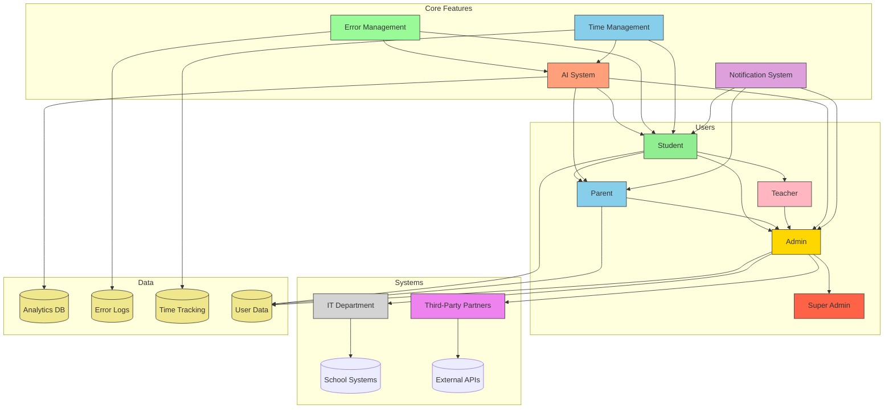

# Exam Preparation Platform Product Requirements Document

## 1. Executive Summary
A web-based platform designed to help IGCSE students prepare for exams through realistic test simulations while providing parents and school administrators with comprehensive progress tracking tools. The system will support three distinct user roles with tailored experiences and layered access controls, prioritizing simplicity, ease of use, and efficiency.

## 2. Objectives
- Provide realistic exam simulation environment for students
- Enable parental oversight of academic progress
- Empower school administrators with institutional analytics
- Ensure secure handling of sensitive educational data
- Support scalable user management for educational institutions
- Implement AI-driven personalized learning paths
- Focus on error management and improvement tracking
- Support efficient time management and study habits

## 3. Stakeholders

**Relationship Explanation:**
- **Users**
  - **Students** are central to all interactions
  - **Parents** connect through student linkages
  - **Teachers** interact with students and administrators
  - **Admins** manage all user relationships
  - **Super Admins** oversee security and system-wide operations

- **Systems**
  - **IT Department** maintains infrastructure integrations
  - **Third-Party Partners** provide external system integrations
  - **School Systems** integrate with the platform
  - **External APIs** provide additional functionality

- **Core Features**
  - **AI System** provides personalized learning paths and insights
  - **Error Management** tracks and analyzes student mistakes
  - **Time Management** optimizes study sessions and progress
  - **Notification System** handles all user communications

- **Data**
  - **Analytics DB** stores performance metrics
  - **Error Logs** track learning patterns
  - **Time Tracking** monitors study habits
  - **User Data** manages account information

## 4. User Roles & Permissions
| Role | Access Level | Key Permissions |
|------|--------------|-----------------|
| Student | Basic | Test taking, Personal analytics, Profile management, Error tracking, Progress monitoring |
| Parent | Intermediate | Student progress monitoring, Notification management, Performance analytics |
| Admin | Elevated | User management, System configuration, Institutional analytics, Error pattern analysis |
| Super Admin | Highest | Security controls, Audit logs, Backup management, System-wide analytics |

## 5. Core Features

### 5.1 User Management Module
- **Student Portal**
  - Simplified registration with essential information only
  - Secure credential management (JWT authentication)
  - Password recovery with email verification
  - Profile customization with academic preferences
  - Clear, intuitive interface with minimal friction

- **Parent Portal**
  - Streamlined student account linking
  - Multi-factor authentication options
  - Notification preference center
  - Simplified progress tracking interface

- **Admin Console**
  - Bulk CSV import/export of user accounts
  - Role-based access control (RBAC) system
  - Audit trail with activity monitoring
  - Simplified user management interface

### 5.2 Exam Simulation Module
- Timed practice exams with real test conditions
- Subject-specific question banks
- Instant scoring with performance breakdowns
- Historical attempt comparison charts
- Error management system with:
  - Immediate error logging
  - AI-powered error categorization
  - Personalized practice sets
  - Rolling review system
- Micro-unit time management
- AI-driven insights and encouragement

### 5.3 Analytics & Reporting
- Real-time student progress dashboards
- Institutional benchmarking tools
- Custom report builder with filters:
  - By subject
  - By date range
  - By performance quartiles
- Automated report scheduling (daily/weekly/monthly)
- Error pattern analysis
- Time management analytics

### 5.4 Notification System
- Event-driven alerts for:
  - Completed tests
  - Account changes
  - System updates
  - Error review reminders
  - Study time recommendations
- Multi-channel delivery (Email/SMS/In-app)
- Configurable escalation paths

## 6. Technical Requirements

### 6.1 Architecture
- Frontend: React PWA with offline capabilities
- Backend: Node.js microservices architecture
- Database: MongoDB with Redis caching
- Analytics: Elasticsearch + Kibana dashboard
- AI Integration: TensorFlow for personalized learning

### 6.2 Security
- Role-based data access controls
- Encryption at rest (AES-256) and in transit (TLS 1.3)
- Regular penetration testing requirements
- GDPR-compliant data handling procedures
- Simplified yet secure authentication flows

### 6.3 Performance
- <500ms API response times under load
- Support 10,000 concurrent exam sessions
- 99.9% uptime SLA for core features
- Optimized for mobile responsiveness
- Efficient error tracking and analysis

### 6.4 AI Development Strategy
- Leverage AI-assisted coding tools for:
  - Automated code generation (40% of boilerplate)
  - Intelligent test case creation
  - Security vulnerability scanning
  - Performance optimization suggestions
- Maintain human oversight for:
  - Architectural decisions
  - Compliance implementations
  - User experience flows
  - Sensitive data handling
- Focus on AI-driven features:
  - Error pattern recognition
  - Personalized learning paths
  - Time management optimization
  - Performance prediction

## 7. Compliance Requirements
- COPPA compliance for under-13 users
- FERPA-compliant data storage (US)
- GDPR-compliant data processing (EU)
- WCAG 2.1 AA accessibility standards
- Mobile-first responsive design

## 8. Milestones (AI-Accelerated)

| Phase | Timeline | Deliverables | AI Impact Areas |
|-------|----------|--------------|-----------------|
| 1 | Q2 2025 | Core student exam experience | - AI-generated UI components - Automated test suites - Schema optimization - Error tracking system |
| 2 | Q3 2025 | Parent portal & basic analytics | - Smart API generation - Predictive analytics models - Access control templates - Time management features |
| 3 | Q4 2025 | Admin console & institutional tools | - Automated RBAC configs - AI-optimized queries - Compliance rule generation - Error pattern analysis |
| 4 | Q1 2026 | Advanced reporting & SIS integrations | - NLP-based report drafting - Intelligent API connectors - Auto-generated docs - Advanced analytics |

## 9. Success Metrics
- 80% student retention rate after first test
- 95% parent account activation rate
- <2% failed login attempt rate
- 90% institutional renewal rate
- 70% error reduction rate
- 85% time management improvement

## 10. Risks & Mitigations
- **Data Security Risks**: Regular audits + bug bounty program
- **User Adoption Risks**: Onboarding tutorials + institutional training
- **Performance Risks**: Load testing + auto-scaling infrastructure
- **Compliance Risks**: Legal review team + regional configuration
- **AI Development Risks**: 
  - Mitigation: Hybrid review process + architecture guardrails
  - Mitigation: Version-controlled AI artifacts
  - Mitigation: Regular human audit checkpoints
- **User Experience Risks**:
  - Mitigation: Regular user feedback sessions
  - Mitigation: A/B testing of interface changes
  - Mitigation: Mobile-first design approach

## 11. Future Roadmap
- AI-powered adaptive learning paths
- Mobile app development (iOS/Android)
- Virtual proctoring capabilities
- Social learning features
- Marketplace for third-party content
- Advanced error prediction system
- Personalized study schedule optimization
- Real-time performance analytics 